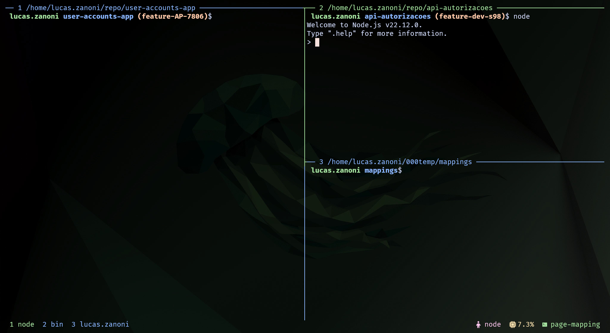
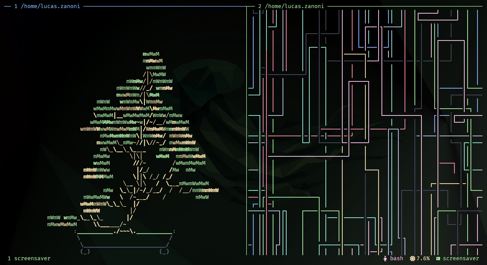
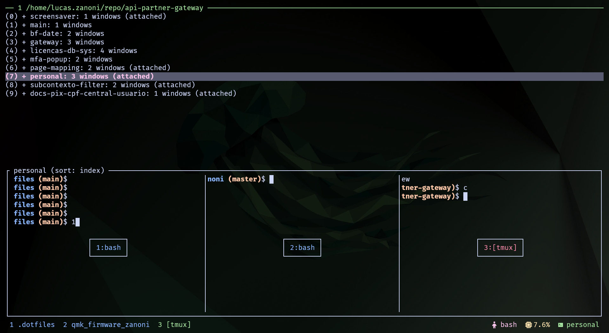
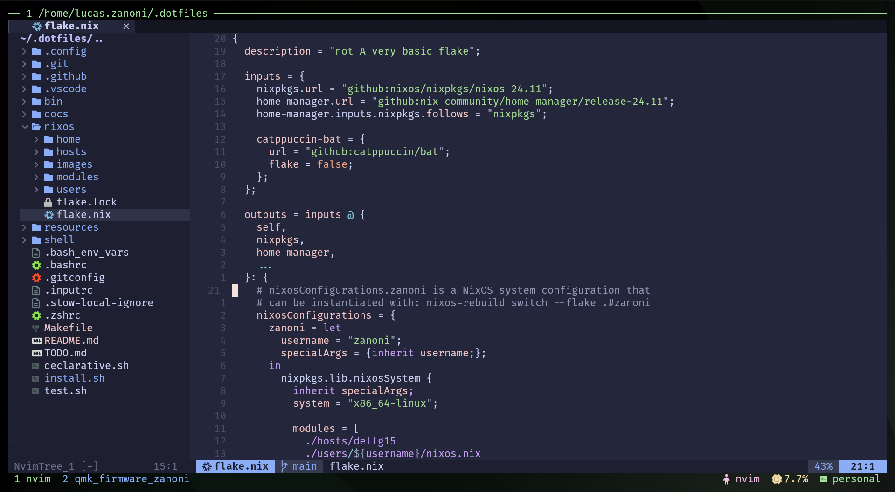
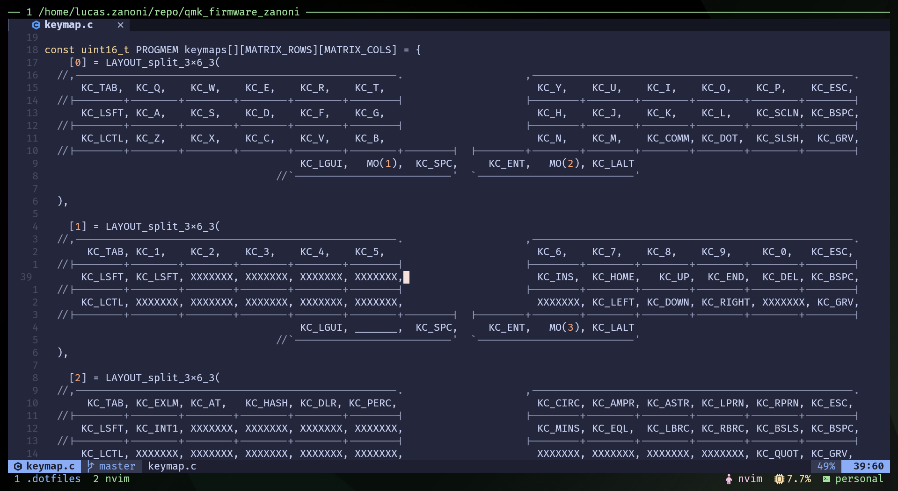

## This repo works as a historical record of my configs. Before tag [1.2.0](https://github.com/castrozan/.dotfiles/releases/tag/1.2.0) of my [dotfiles](https://github.com/castrozan/.dotfiles), i was using this bash framework to manage my configs, now i'm using [Nix](https://nixos.org/) and [NixOS](https://nixos.org/nixos/manual/index.html).

## TODO: remove nix from this repo as it is suposed to be just the bash framework.

<h2 align="center">Zanoni's Desktop Configs</h2>

<p align="center">
  
</p>

<p align="center">
   
   <a href="https://nixos.org/">
      
   </a>
   <a href="https://github.com/ryan4yin/nixos-and-flakes-book">
      
   </a>
</p>

This repository contains the setup for my desktop environment on both NixOS and Ubuntu. It includes scripts for installing necessary applications and configuring dotfiles to set up a new system.

## 🎬 Showcase: Hyprland + Bash + Kitty + Neovim 
*(More screenshots & videos coming soon!)*
<!-- TODO: add desktop video showcase -->

### Hyprland
<!-- TODO: add screenshots -->

### Kitty ᓚᘏᗢ + Tmux

<details>
<summary>🪟 Panes</summary>



</details>
<details>
<summary>🪴 Screensaver</summary>



</details>
<details>
<summary>🔱 Sessions</summary>



</details>

### Neovim

<details>
<summary>:wq Editor</summary>



</details>
<details>
<summary>🎯 Focused Editor</summary>



</details>

## 📂 Repository Structure

- **README.md** – Quick start & overview (this file)
- **docs/** – Detailed guides:
  - [Ubuntu Setup](docs/ubuntu.md)
- **nixos/** – NixOS configurations with [detailed setup guide](nixos/README.md)
- **ubuntu/** – This does not exists since it's all scattered around (*.rc, .config, bin, etc.)

## ⚙️ Quick Start

### NixOS Users
1. **Clone the repo into your home directory.**
2. **Generate Hardware Config:**
   Replace [my hosts](nixos/hosts) with `your_host`:
   ```bash
   nixos-generate-config --dir nixos/hosts/your_host/configs
   ```
3. **Update Users:**
   Replace [my users](nixos/users) with `your_user` directory:

3. **Deploy the Flake:**
   Replace the user and host on the nixosConfigurations module and run the flake:
   ```bash
   sudo nixos-rebuild switch --flake .#your_user
   ```

See the [NixOS Setup Guide](nixos/README.md) for detailed instructions.

### Ubuntu Users
1. **Clone the repo into your home directory.**
2. **Run the installer:**
   ```bash
   make install
   ```
   Use the `-d` flag to install only selected configurations (see [docs/ubuntu.md](docs/ubuntu.md) for details).

## 🔗 Inspiration
This setup is inspired by projects like:
- [ryan4yin/nix-config](https://github.com/ryan4yin/nix-config)
- [OfflineBot/nixos](https://github.com/OfflineBot/nixos)
- and many others, sorry there are too many i don't remember.

Enjoy ricing and happy hacking!
