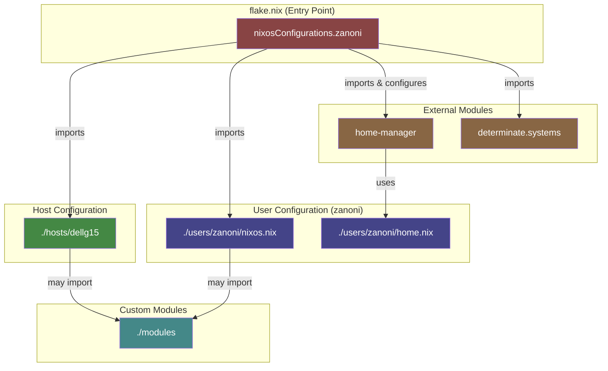

# NixOS Setup Guide

This guide explains how to deploy the NixOS configuration from this repository using Nix Flakes. The configuration is designed for systems running NixOS.

## NixOS Configuration Diagram

Here's a high-level overview of how the NixOS configuration is structured:



## Prerequisites

Before you begin, make sure you have:
- A NixOS system installed (the GNOME, 64-bit Intel/AMD option is recommended for beginners).

## Steps to Deploy

### 1. **Clone the repo into your home directory.**

### 2. Review Host and User Configurations

Take a look at the following directories:
- **nixos/hosts:** Contains configuration examples for different machines. Use these as a template for your own host configuration.
- **nixos/users:** Includes user-specific configurations. The `zanoni` example can serve as a model for creating your own setup.

### 3. Generate Hardware Configuration

Create a hardware configuration to your new nixoa inatalation on the system (new installs have different configs for the same system).
```bash
nixos-generate-config --dir nixos/hosts/dellg15/configs
```
This command generates a `hardware-configuration.nix` file that NixOS uses for hardware-specific settings.

### 4. Build and Deploy the Flake

Replace the user and host on the nixosConfigurations module in the [flake](/nixos/flake.nix) and run the flake:
```bash
sudo nixos-rebuild switch --flake .#zanoni
```
This command applies the configuration defined in the flake to your system.

### 5. Post-Deployment

After deployment:
- Restart your system is advised.
- Verify that the new settings are active.
- Continue tweaking your configurations to fit your workflow.

## Troubleshooting & Tips

- **Additional Resources:** Visit the [NixOS Manual](https://nixos.org/manual) for comprehensive documentation.
